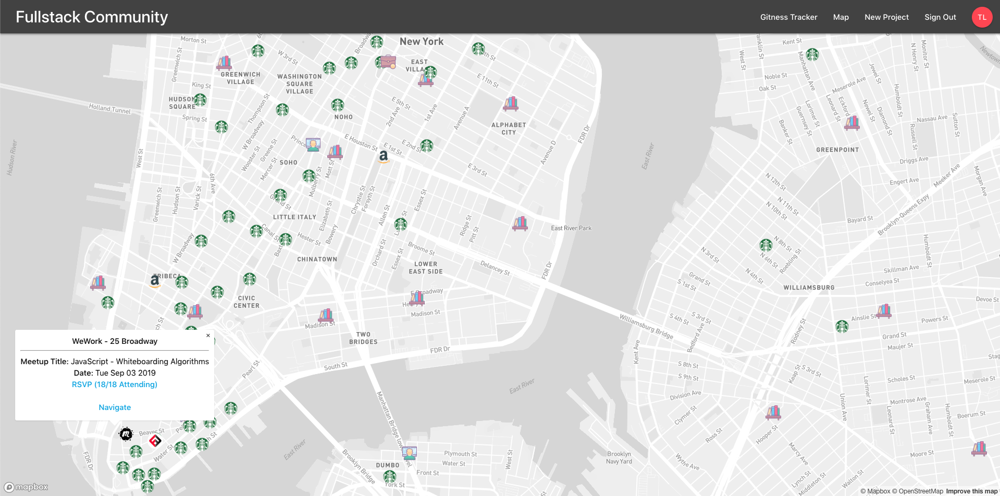

# Fullstack Community - Always Be Coding. Together

## Video Presentation

## Deployed Web App

<https://fullstack-community.web.app>

## Description

Fullstack Academy themed responsive web app that connects past and present Fullstack Academy and Grace Hopper students for networking purposes. The app allows current students and job seeking alums to form study groups, work on projects, practice algorithms, and assist one another in the job search.

MVP completed in 4 days for a solo project, and is continually being improved upon for the benefit of future Fullstack Academy and Grace Hopper generations to come.

## Tech Stack

Built using Node.js and Firebase on the backend, React, Redux, and Materialize.css on the frontend, and utilizes the Mapbox, MTA, Socrata, and NYC Open Data APIs.

## Dev Team

- Tal Luigi ([LinkedIn](https://www.linkedin.com/in/talluigi) | [GitHub](https://github.com/luigilegion))

## Dev Env Setup

- Clone the repo and `cd` into it
- `npm install` to install the dependencies
- Rename all `.example.js` files to remove `.example` in the `src/config/` directory
- Rename all `.example.js` files to remove `.example` in the `src/data/` directory
- Fill in your keys and dummy data
- `npm run start` to spin up the dev env
